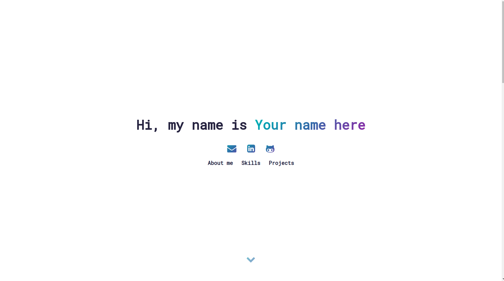

# Portfolio :sparkles:

<a id="About"></a>

## 📝 About

A simple and responsive portfolio template.

<a id="used-technologies"></a>

## :rocket: Used Technologies

This project was developed using the following technologies

- HTML
- CSS
- JS

## :heavy_check_mark: Result:

<h2 align="center">
  
  <br>
</h2>

To view a demo example, **[click here](https://thalytabdn.github.io/Portfolio/)**


<a id="how-to-use"></a>

## ✨ How to use

1. Make a clone :

```sh
  $ git clone https://github.com/thalytabdn/Portfolio
```

2. Aadd your information in the index.html file
  ---
  
<h4 align="center">
    Feito com 💓 by <a href="https://www.linkedin.com/in/thalytabdn/" target="_blank">Thalyta Barbosa</a>
</h4>
