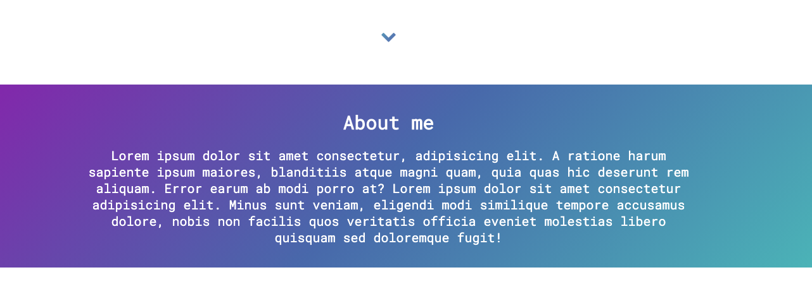

# Portfolio :sparkles:

To view a demo example, **[click here](https://thalytabdn.github.io/Portfolio/)**

<a id="About"></a>

## 📝 About

A simple and responsive portfolio template.
You need to open the index.html file and change anything that is wrapped with { }
Ypu can follow the guide below.


### Introduction

[Go to code] (https://github.com/thalytabdn/Portfolio/blob/master/index.html#L34)

### About me

[Go to code] (https://github.com/thalytabdn/Portfolio/blob/master/index.html#L75)


Upload your Resume under asset folder as Resume.pdf : 

[Go to code] (https://github.com/thalytabdn/Portfolio/blob/master/assets/Resume.pdf)

### SKills

[Go to code] (https://github.com/thalytabdn/Portfolio/blob/master/index.html#L90)

### Projects

[Go to code] (https://github.com/thalytabdn/Portfolio/blob/master/index.html#L163)

<a id="used-technologies"></a>

## :rocket: Used Technologies

This project was developed using the following technologies

- HTML
- CSS
- JS

<a id="how-to-use"></a>

## :rocket: How to use

1. Make a clone :

```sh
  $ git clone https://github.com/thalytabdn/Portfolio
```

2. Add your information in the index.html file

## ✨ Contributing

1. Fork this repository
2. Improve current code by:
    - improving the style
    - adding new feature
    - improving the documentation
3. Push your work and create a Pull Request

## License 📄

This project is licensed under the MIT License - see the [LICENSE.md](LICENSE) file for details

  ---
<h4 align="center">
    Build with 💓 by <a href="https://www.linkedin.com/in/thalytabdn/" target="_blank">Thalyta Barbosa</a>
</h4>
